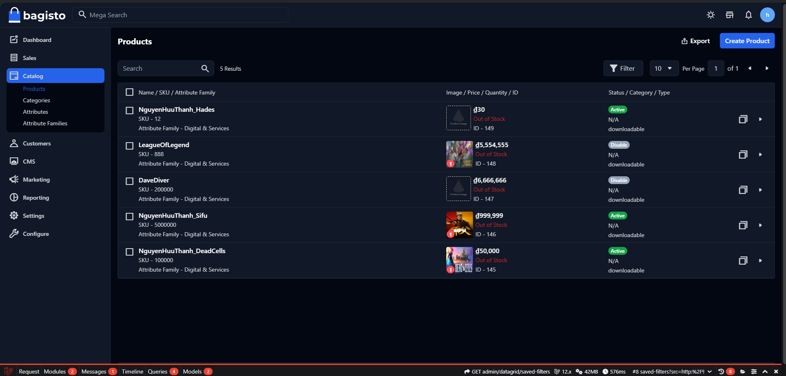
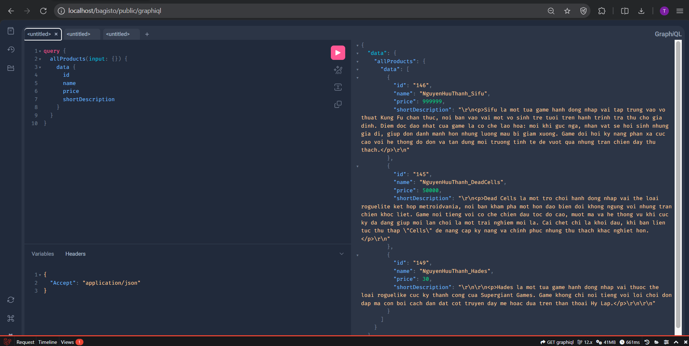
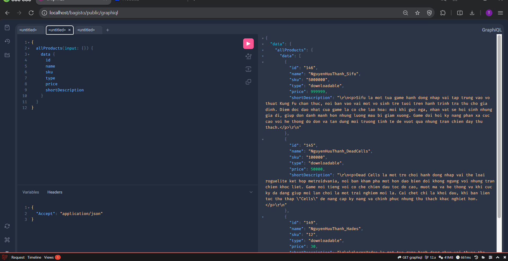
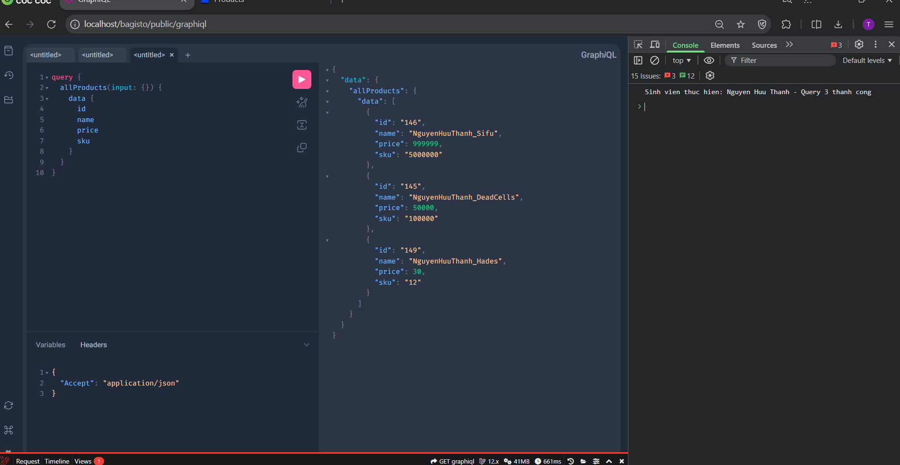

#  BÁO CÁO BÀI TẬP GRAPHQL - BAGISTO HEADLESS
**Sinh viên:** Nguyễn Hữu Thành  
**MSSV:** 23810310389  
**Dự án:** Khai phá Headless eCommerce với Bagisto & GraphQL

---

##  PHẦN 1: CÀI ĐẶT HỆ THỐNG
Em đã thực hiện cài đặt và cấu hình hệ thống theo đúng quy trình tài liệu Bagisto Headless Documentation:
* **Composer:** Cài đặt gói `bagisto/bagisto-headless`.
* **Database:** Chạy `php artisan migrate` để đồng bộ cơ sở dữ liệu.
* **Cấu hình:** Kích hoạt quyền truy cập API trong Admin Panel (Configuration -> Headless).

###  Hình ảnh minh họa:
* **Danh sách sản phẩm định danh trong Admin:**

---

##  PHẦN 2: KHAI THÁC GRAPHQL API
Sử dụng công cụ **GraphQL Playground** để truy vấn dữ liệu trực tiếp từ Server.

### 1. Các Query cơ bản
* **Query 1:** Lấy danh sách Categories (ID, Name, Slug).
* **Query 2:** Lấy 05 sản phẩm mới nhất (ID, Name, Price, SKU, Type, Description).

### 2. Query 3 (Nâng cao): Lọc sản phẩm theo tên sinh viên
* **Yêu cầu:** Sử dụng bộ lọc `filters` để lấy đúng 03 sản phẩm chứa tên "Nguyễn Hữu Thành".
* **Minh chứng:** Kết quả trả về chính xác kèm dòng chữ định danh tại Tab Console.

---

##  PHẦN 3: XÂY DỰNG FRONTEND (demo.html)
Xây dựng trang web hiển thị sản phẩm bằng **HTML5/JavaScript (Fetch API)**.

* **Header:** Hiển thị thông tin sinh viên nổi bật trên nền đỏ.
* **Body:** Hiển thị danh sách 05 sản phẩm mới nhất dưới dạng **Cards** hiện đại.
* **Kỹ thuật:** Sử dụng `fetch()` gửi yêu cầu `POST` kèm Header định dạng JSON.

###  Giao diện thực tế:

###  Mã nguồn chi tiết:

---

##  PHẦN 4: CÂU HỎI BẮT BUỘC

### 1. So sánh lưu lượng dữ liệu (Payload)
> **Sự khác biệt nằm ở tính tối ưu hóa:**
> * **REST API (Over-fetching):** Server trả về toàn bộ các trường dữ liệu mặc định (thông tin thuế, tồn kho, cân nặng...). Điều này gây lãng phí băng thông và làm chậm tốc độ tải trang.
> * **GraphQL (Tối ưu):** Em chỉ yêu cầu các trường cần thiết như `name`, `price`, `sku`. Server chỉ đóng gói đúng những gì được yêu cầu vào JSON, giúp Payload cực nhẹ và tốc độ phản hồi cực nhanh.

### 2. Thay đổi giá sản phẩm: Query hay Mutation?
> **Lựa chọn:** Em sử dụng **Mutation**.
> 
> **Giải thích:** > * **Query** chỉ dùng cho các hành động **Đọc (Read)** dữ liệu.
> * **Mutation** là hành động bắt buộc khi muốn **Thay đổi (Write/Update)** trạng thái dữ liệu trên Server (như cập nhật giá). Mutation đảm bảo tính nhất quán và cho phép Server thực hiện kiểm tra logic trước khi ghi đè dữ liệu.

---
*Báo cáo được hoàn thành bởi Nguyễn Hữu Thành vào ngày 03/04/2026.*
